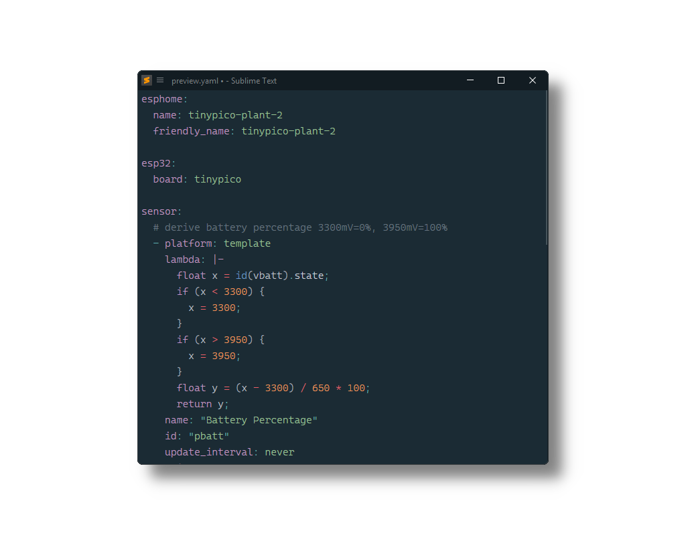

#  ESPHome

[ESPHome YAML configuration file](https://esphome.io/guides/yaml/) syntax for [Sublime Text](https://www.sublimetext.com) based on its YAML syntax.

## Installation

### Package Control

The easiest way to install is using [Package Control](https://packagecontrol.io). It's listed as `ESPHome`.

1. Open `Command Palette` using <kbd>ctrl+shift+P</kbd> or menu item `Tools → Command Palette...`
2. Choose `Package Control: Install Package`
3. Find `ESPHome` and hit <kbd>Enter</kbd>

### Manual Install

1. Download appropriate [ESPHome.sublime-package](https://github.com/SublimeText/ESPHome/releases) for your Sublime Text build.
2. Copy it into _Installed Packages_ directory

> [!NOTE]
>
> To find _Installed Packages_...
>
> 1. call _Menu > Preferences > Browse Packages.._
> 2. Navigate to parent folder

> [!WARNING]
>
> Manually installed packages are not automatically updated by Package Control.

## Usage

To apply the syntax, select `YAML (esphome)` from the Command Palette or from the syntax selector in the status bar.

Since ESPHome configuration files use the `.yml`/`.yaml` extension and do not differ much from standard YAML files, there is no easy way to automatically assign it to all ESPHome configuration files (unless you want to use this syntax for all YAML files, which could introduce its own problems). Therefore, it is recommended to use the [ApplySyntax](https://packages.sublimetext.io/packages/ApplySyntax) or [AutoSetSyntax](https://packages.sublimetext.io/packages/AutoSetSyntax) package to assign this syntax based on the file path - most likely on a per-project basis since there is nothing inherently unique about the file names or paths of these configuration files.
